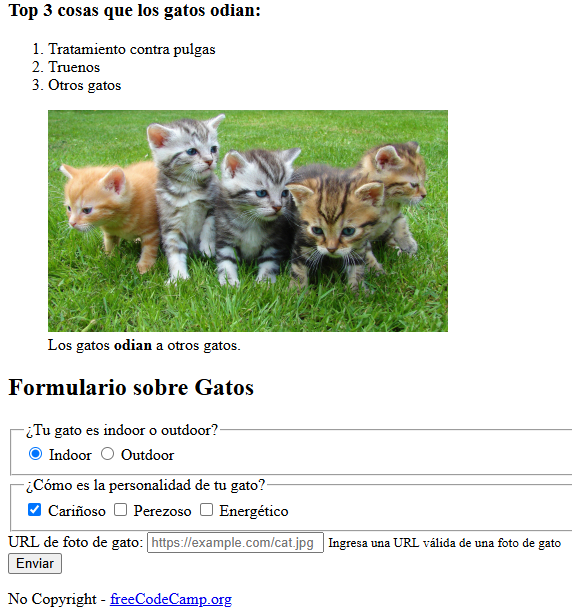

# 🐱 CatPhotoApp

Proyecto educativo mejorado con accesibilidad y optimizaciones. ¡Aprende HTML/CSS/JS mientras creas una galería felina!

  

## 🌟 Características Principales

| ✅ Accesibilidad | ⚡ Performance | 📱 Responsive |
|------------------|---------------|--------------|
| Roles ARIA       | Lazy Loading  | Mobile-first |
| Semántica HTML5  | Defer Scripts | Flexbox      |

## 🚀 Comenzar

### Opción 1: Clonar
git clone https://github.com/Alanordinola/CatPhotoApp.git

### Opción 2: Fork

**Requisitos**:  
✔ Navegador moderno (Chrome 100+, Firefox 90+)  
✔ Node.js 16+ (opcional para desarrollo)

## 🧩 Estructura del Proyecto

📁 CatPhotoApp  
├── 📁 assets  
│   ├── 📁 css        (*próximamente*)  
│   ├── 📁 js         (*en desarrollo*)  
│   └── 📁 img        (*imágenes locales*)  
├── 📁 docs  
│   ├── 📄 ARCHITECTURE.md  
│   ├── 📄 CHANGELOG.md  
│   └── 📄 ROADMAP.md  
└── 📄 index.html     (*v2.1+*)

## 🤝 Cómo Contribuir

1. Haz fork del proyecto

2. Crea una rama (git checkout -b feature/nueva-funcionalidad)

3. Sigue los estándares:
- Commits en inglés: *add image carousel*
- Documenta cambios en CHANGELOG.md

4. Envía un Pull Request

## 📅 Próximos Pasos

### 🎨 Frontend

- [ ]  **Estilos CSS**  
  ✓ Implementar grid para galería  
  ✓ Diseñar formulario responsive  
  ✓ Añadir variables de colores

### ⚙️ Funcionalidades

- [ ]  **Validación JS**  
  ✓ Campos obligatorios  
  ✓ Formato de email  
  ✓ Feedback visual

### 🚀 Optimizaciones

- [ ]  **Performance**  
  ✓ Convertir imágenes a WebP  
  ✓ Minificar assets  
  ✓ Lazy loading avanzado

### 📚 Documentación

- [ ]  **Guías**  
  ✓ Tutorial para contribuidores  
  ✓ Checklist de accesibilidad  
  ✓ Estándares de código
  

Hecho con ❤️ para el [curso de freeCodeCamp](https://www.freecodecamp.org/learn/2022/responsive-web-design/)  

