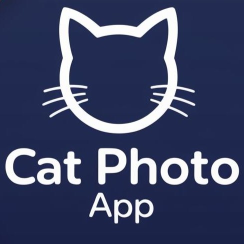

[![Contributors][contributors-shield]][contributors-url]
[![Forks][forks-shield]][forks-url]
[![Stargazers][stars-shield]][stars-url]
[![Issues][issues-shield]][issues-url]
[![project_license][license-shield]][license-url]
[![LinkedIn][linkedin-shield]][linkedin-url]


<!-- PROJECT LOGO -->
<br />
<div align="center">
  <a href="https://github.com/Alanordinola/CatPhotoApp">
    
  </a>

<h3 align="center">Cat Photo App</h3>

  <p align="center">
    Learn HTML/CSS/JS while creating a cat gallery!
    <br />
    <a href="https://github.com/Alanordinola/CatPhotoApp"><strong>Explore the docs »</strong></a>
    <br />
    <br />
    <a href="https://github.com/Alanordinola/CatPhotoApp">View Demo</a>
    &middot;
    <a href="https://github.com/Alanordinola/CatPhotoApp/issues/new?labels=bug&template=bug-report---.md">Report Bug</a>
    &middot;
    <a href="https://github.com/Alanordinola/CatPhotoApp/issues/new?labels=enhancement&template=feature-request---.md">Request Feature</a>
  </p>
</div>


<!-- TABLE OF CONTENTS -->
<details>
  <summary>Table of Contents</summary>
  <ol>
    <li>
      <a href="#about-the-project">About The Project</a>
      <ul>
        <li><a href="#built-with">Built With</a></li>
      </ul>
    </li>
    <li>
      <a href="#getting-started">Getting Started</a>
      <ul>
        <li><a href="#prerequisites">Prerequisites</a></li>
        <li><a href="#installation">Installation</a></li>
      </ul>
    </li>
    <li><a href="#usage">Usage</a></li>
    <li><a href="#roadmap">Roadmap</a></li>
    <li><a href="#contributing">Contributing</a></li>
    <li><a href="#license">License</a></li>
    <li><a href="#contact">Contact</a></li>
    <li><a href="#acknowledgments">Acknowledgments</a></li>
  </ol>
</details>


<!-- ABOUT THE PROJECT -->
## About The Project

[![Product Name Screen Shot][product-screenshot]](https://example.com)

**CatPhotoApp** is a beginner-friendly web project developed as part of FreeCodeCamp's Responsive Web Design certification. It serves as a hands-on learning tool for:

- HTML5 semantics (forms, accessible structure)
- CSS fundamentals (upcoming)
- JavaScript integration (future scope)

**Key features:**

- Clean, commented code for easy learning
- Responsive-ready layout
- Form validation example

Designed to help new developers practice core web technologies while creating a fun, interactive cat photo gallery.

<p align="right">(<a href="#readme-top">back to top</a>)</p>


### Built With

* [![HTML5][HTML5-shield]][HTML5-url]
* [![CSS3][CSS3-shield]][CSS3-url]
* [![JavaScript][JavaScript-shield]][JavaScript-url]

<p align="right">(<a href="#readme-top">back to top</a>)</p>


<!-- GETTING STARTED -->
## Getting Started

To get a local copy up and running follow these simple example steps.

### Prerequisites
  
- A modern web browser (Chrome, Firefox, Edge)
- Basic understanding of HTML (optional, for customization)

### Installation

1. **Clone the repository:**

 ```sh
git clone https://github.com/Alanordinola/CatPhotoApp.git
```
2. **Navigate to the project folder:**
```sh
cd CatPhotoApp
```
3. **Open in browser:**

Double-click index.html or run
```bash
open index.html  # macOS
start index.html # Windows
```

<p align="right">(<a href="#readme-top">back to top</a>)</p>


<!-- USAGE EXAMPLES -->
## Usage

1. **Browse cat photos** in the gallery
2. **Practice with HTML forms** (simulated submission)
3. **Edit files** to learn:
   - Add images: `` in `index.html`
   - Customize styles in `styles.css`
4. **Refresh browser** to see changes


#### Perfect for practicing basic HTML/CSS. Customize it!


<p align="right">(<a href="#readme-top">back to top</a>)</p>


<!-- ROADMAP -->
## Roadmap

- [ ] ***Semantic HTML***
  - [x] Improve structure with `<section>` and `<article>`
  - [x] Add ARIA tags for accessibility
  - [ ] Implement `<picture>` for responsive images
- [ ]  ***CSS Style***
  - [ ]  Implement gallery grid
  - [ ]  Design responsive form
  - [ ]  Add color variables
  
- [ ]  ***JS validation***
  - [ ]  Required fields
  - [ ]  Email format
  - [ ]  Visual feedback


See the [open issues](https://github.com/Alanordinola/CatPhotoApp/issues) for a full list of proposed features (and known issues).

<p align="right">(<a href="#readme-top">back to top</a>)</p>


<!-- CONTRIBUTING -->
## Contributing

Contributions are what make the open source community such an amazing place to learn, inspire, and create. Any contributions you make are greatly appreciated.

If you have a suggestion that would make this better, please fork the repo and create a pull request. You can also simply open an issue with the tag "enhancement". Don't forget to give the project a star! Thanks again!

1. Fork the Project
2. Create your Feature Branch (`git checkout -b feature/AmazingFeature`)
3. Commit your Changes (`git commit -m 'Add some AmazingFeature'`)
4. Push to the Branch (`git push origin feature/AmazingFeature`)
5. Open a Pull Request

<p align="right">(<a href="#readme-top">back to top</a>)</p>

### Top contributors:

<a href="https://github.com/Alanordinola/CatPhoyoApp/graphs/contributors">
  
</a>


<!-- LICENSE -->
## License

Distributed under the project_license. See `LICENSE.txt` for more information.

<p align="right">(<a href="#readme-top">back to top</a>)</p>


<!-- CONTACT -->
## Contact

Alan Ordinola - [Linkedin](https://www.linkedin.com/in/alan-ordinola-10026a196/)

Project Link: [https://github.com/Alanordinola/CatPhotoAPP](https://github.com/Alanordinola/CatPhotoApp)

<p align="right">(<a href="#readme-top">back to top</a>)</p>


<!-- ACKNOWLEDGMENTS -->
## Acknowledgments

Hecho con ❤️ para el [curso de freeCodeCamp](https://www.freecodecamp.org/learn/2022/responsive-web-design/)  
[](https://www.freecodecamp.org/)

[Best-README-Template](https://github.com/othneildrew/Best-README-Template) - Por la estructura base de este README

<p align="right">(<a href="#readme-top">back to top</a>)</p>


<!-- MARKDOWN LINKS & IMAGES -->
<!-- https://www.markdownguide.org/basic-syntax/#reference-style-links -->
[contributors-shield]: https://img.shields.io/github/contributors/Alanordinola/CatPhotoApp.svg?style=for-the-badge&color=green
[contributors-url]: https://github.com/Alanordinola/CatPhotoApp/graphs/contributors
[forks-shield]: https://img.shields.io/github/forks/Alanordinola/CatPhotoApp.svg?style=for-the-badge&color=blue
[forks-url]: https://github.com/Alanordinola/CatPhotoApp/network/members
[stars-shield]: https://img.shields.io/github/stars/Alanordinola/CatPhotoApp.svg?style=for-the-badge&color=yellow
[stars-url]: https://github.com/Alanordinola/CatPhotoApp/stargazers
[issues-shield]: https://img.shields.io/github/issues/Alanordinola/CatPhotoApp.svg?style=for-the-badge&color=red
[issues-url]: https://github.com/Alanordinola/CatPhotoApp/issues
[license-shield]: https://img.shields.io/github/license/Alanordinola/CatPhotoApp.svg?style=for-the-badge&color=green
[license-url]: https://github.com/Alanordinola/CatPhotoApp/blob/main/LICENSE.txt
[linkedin-shield]: https://img.shields.io/badge/-LinkedIn-black.svg?style=for-the-badge&logo=linkedin&colorB=0A66C2
[linkedin-url]: https://www.linkedin.com/in/alan-ordinola-10026a196/
[product-screenshot]: images/screenshot.png
[HTML5-shield]: https://img.shields.io/badge/HTML5-E34F26?style=for-the-badge&logo=html5&logoColor=white
[HTML5-url]: https://developer.mozilla.org/en-US/docs/Web/HTML
[CSS3-shield]: https://img.shields.io/badge/CSS3-1572B6?style=for-the-badge&logo=css3&logoColor=white
[CSS3-url]: https://developer.mozilla.org/en-US/docs/Web/CSS
[JavaScript-shield]: https://img.shields.io/badge/JavaScript-F7DF1E?style=for-the-badge&logo=javascript&logoColor=black
[JavaScript-url]: https://developer.mozilla.org/en-US/docs/Web/JavaScript
